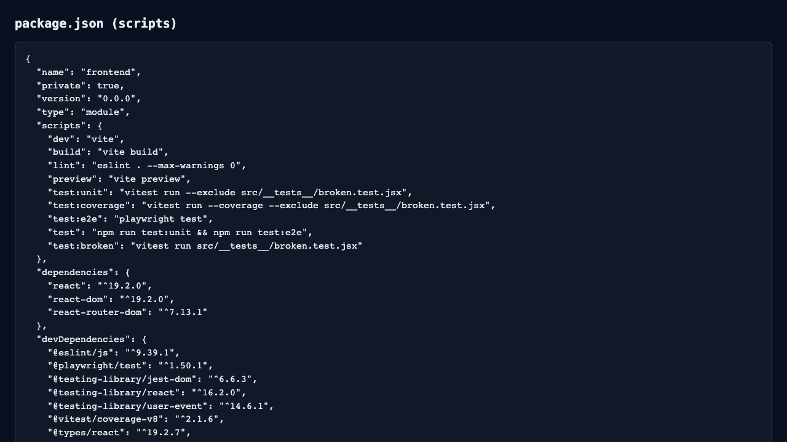
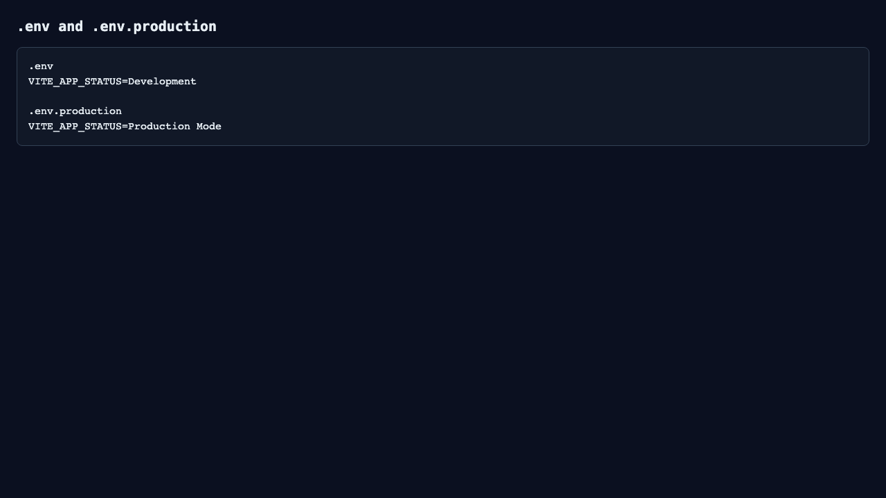
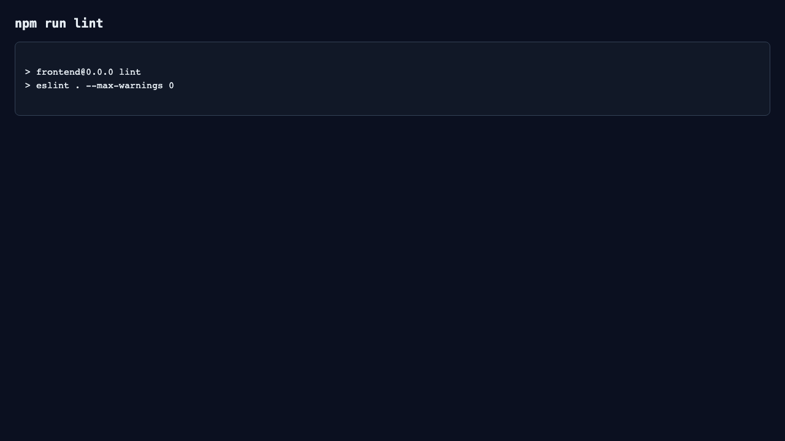
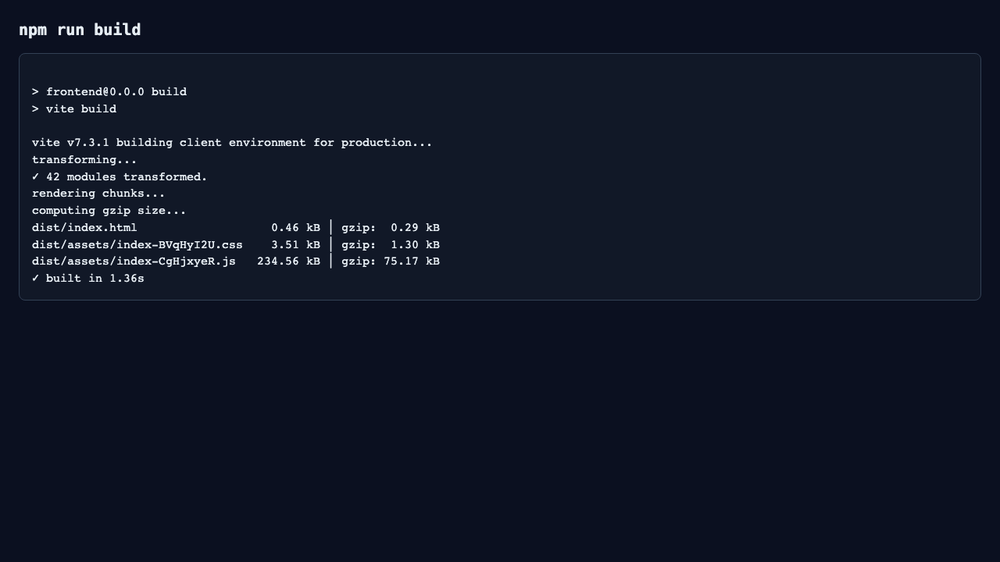
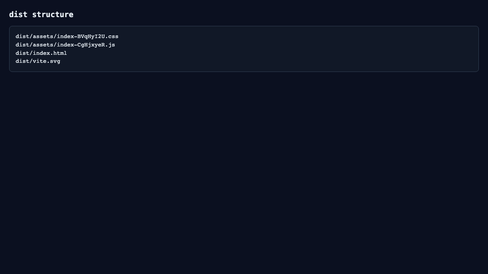
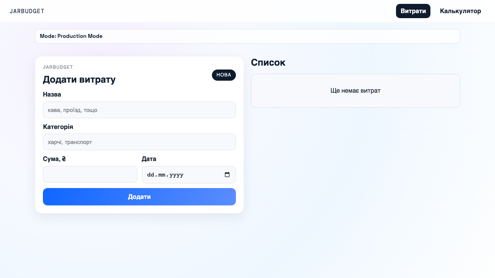
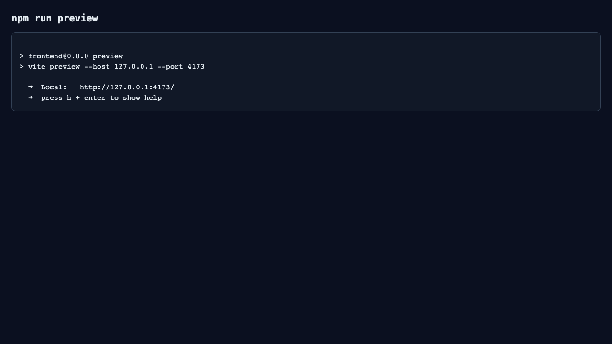
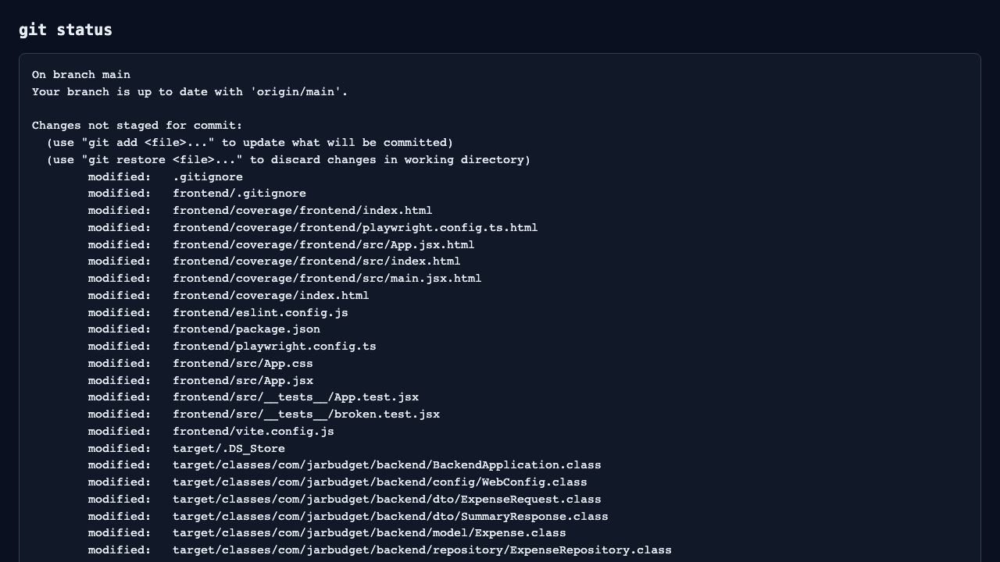
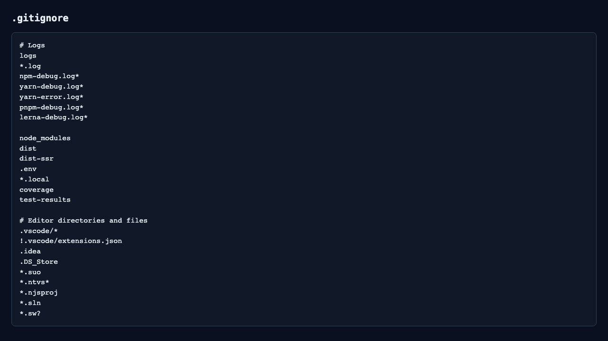

# 1. Тема роботи

Лабораторна робота №3: **«Автоматизація збірки проєкту та управління артефактами»**.

# 2. Мета роботи

Метою роботи було опанувати базові принципи автоматизації життєвого циклу фронтенд-застосунку, навчитися налаштовувати процес збірки в середовищі Vite, коректно працювати зі змінними оточення, виконувати статичний аналіз коду через ESLint, формувати production-артефакт і контролювати гігієну репозиторію.

# 3. Теоретичні відомості

Автоматизація збірки — це підхід, за якого типові технічні дії виконуються скриптами: запуск dev-сервера, перевірка коду, збірка, перегляд production-версії. Це зменшує ручні помилки та забезпечує відтворюваний результат.

Build tools — це інструменти, які перетворюють сирцевий код у готовий продукт для запуску в браузері. Вони виконують транспіляцію, бандлінг, оптимізацію та мініфікацію.

Vite — сучасний інструмент збірки, орієнтований на швидкий запуск у режимі розробки та оптимізований production-build. Webpack — універсальний і дуже гнучкий бандлер із ширшими можливостями тонкого налаштування, але зазвичай зі складнішою конфігурацією. Для навчального React-проєкту Vite є зручним через простоту і швидкість.

Бандлінг — це об’єднання модулів застосунку у фінальні JavaScript/CSS файли, які зручно доставляти браузеру.

Транспіляція — перетворення сучасного синтаксису (наприклад JSX) у код, який коректно виконується у цільовому середовищі.

Лінтування — автоматична перевірка коду на потенційні помилки та порушення правил. Це дозволяє виявляти проблеми на ранньому етапі.

Оптимізація — набір дій, спрямованих на підвищення швидкодії застосунку (зменшення розміру ресурсів, ефективне завантаження, кешування).

Мініфікація — зменшення обсягу файлів без зміни логіки програми (видалення зайвих пробілів, скорочення ідентифікаторів тощо).

Sourcemaps — службові карти відповідності між зібраним кодом і джерелами, які спрощують налагодження.

Deployment — процес розгортання застосунку на сервері або хостингу.

Артефакт збірки — це фінальний результат команди збірки (для Vite це вміст папки `dist/`), придатний до деплою.

Режим `dev` орієнтований на розробку та швидке оновлення, тоді як `production` орієнтований на продуктивність, стабільність і компактний розмір файлів.

Змінні оточення потрібні для керування поведінкою застосунку без зміни коду (наприклад, різні параметри для dev і production).

У `package.json` `dependencies` — це бібліотеки, потрібні в runtime, а `devDependencies` — інструменти, потрібні лише на етапах розробки, тестування та збірки.

# 4. Хід роботи

Спочатку я перевірив структуру проєкту і визначив, що фронтенд-частина знаходиться в каталозі `frontend/` і побудована на React + Vite. Далі я послідовно виконав усі етапи лабораторної.

На першому етапі я перевірив `package.json` і впорядкував скрипти. У проєкті були потрібні команди `dev`, `build`, `preview`, `lint`; я залишив стандартний підхід Vite та додатково зробив lint-скрипт строгим (`eslint . --max-warnings 0`), щоб виключити проходження з попередженнями.

Потім я створив файли `.env` і `.env.production`, додав змінну `VITE_APP_STATUS` зі значеннями `Development` та `Production Mode` відповідно. Далі у `App.jsx` реалізував читання цієї змінної через `import.meta.env` і вивів її в інтерфейсі у верхній частині сторінки окремим блоком `Mode: ...`.

На етапі налаштування ESLint я перевірив базову конфігурацію `eslint.config.js`, залишив правило заборони невикористаних змінних (`no-unused-vars` як `error`) і додав до ignore службові каталоги `dist`, `coverage`, `test-results`, щоб лінтер не перевіряв згенеровані артефакти.

Після цього я додав базові конфігурації форматування: `.prettierrc` та `.prettierignore`.

Команда `npm run lint` була виконана успішно. Під час первинної перевірки раніше був warning у згенерованих файлах покриття, після коректного налаштування ignore ця проблема зникла.

Далі я виконав `npm run build`. Після збірки сформувалась папка `dist/` з файлами `index.html`, ресурсами у `dist/assets/` та хешованими назвами JS/CSS-файлів. Хеш у назві потрібний для cache busting: якщо змінюється вміст файлу, змінюється і його ім’я, тому браузер отримує актуальну версію, а не кешовану стару.

Потім я запустив `npm run preview` і перевірив працездатність зібраного артефакту. Інтерфейс у preview-режимі показав `Mode: Production Mode`, тобто підхопилось значення з `.env.production`. У dev-режимі, відповідно, відображається `Mode: Development`.

Окремо я перевірив стан репозиторію через `git status` і налаштування `.gitignore`. Додав/підтвердив ігнорування `node_modules`, `dist`, `.env`. Файл `.env.production` у межах цієї лабораторної можна залишати під git, оскільки він не містить секретів, лише текстовий режим роботи.

Для порівняння обсягу джерел і артефакту я виконав `du -sh src dist`.

# 5. Лістинг основних конфігурацій та фрагментів коду

Нижче наведені ключові файли, що використовувалися в роботі.

## 5.1 Файл `package.json`

```json
{
  "name": "frontend",
  "private": true,
  "version": "0.0.0",
  "type": "module",
  "scripts": {
    "dev": "vite",
    "build": "vite build",
    "lint": "eslint . --max-warnings 0",
    "preview": "vite preview",
    "test:unit": "vitest run --exclude src/__tests__/broken.test.jsx",
    "test:coverage": "vitest run --coverage --exclude src/__tests__/broken.test.jsx",
    "test:e2e": "playwright test",
    "test": "npm run test:unit && npm run test:e2e",
    "test:broken": "vitest run src/__tests__/broken.test.jsx"
  },
  "dependencies": {
    "react": "^19.2.0",
    "react-dom": "^19.2.0",
    "react-router-dom": "^7.13.1"
  },
  "devDependencies": {
    "@eslint/js": "^9.39.1",
    "@playwright/test": "^1.50.1",
    "@testing-library/jest-dom": "^6.6.3",
    "@testing-library/react": "^16.2.0",
    "@testing-library/user-event": "^14.6.1",
    "@vitest/coverage-v8": "^2.1.6",
    "@types/react": "^19.2.7",
    "@types/react-dom": "^19.2.3",
    "@vitejs/plugin-react": "^5.1.1",
    "eslint": "^9.39.1",
    "eslint-plugin-react-hooks": "^7.0.1",
    "eslint-plugin-react-refresh": "^0.4.24",
    "globals": "^16.5.0",
    "jsdom": "^26.0.0",
    "vite": "^7.3.1",
    "vitest": "^2.1.6"
  }
}
```

## 5.2 Файл `eslint.config.js`

```js
import js from '@eslint/js'
import globals from 'globals'
import reactHooks from 'eslint-plugin-react-hooks'
import reactRefresh from 'eslint-plugin-react-refresh'
import { defineConfig, globalIgnores } from 'eslint/config'

export default defineConfig([
  globalIgnores(['dist', 'coverage', 'test-results']),
  {
    files: ['**/*.{js,jsx}'],
    extends: [
      js.configs.recommended,
      reactHooks.configs.flat.recommended,
      reactRefresh.configs.vite,
    ],
    languageOptions: {
      ecmaVersion: 2020,
      globals: globals.browser,
      parserOptions: {
        ecmaVersion: 'latest',
        ecmaFeatures: { jsx: true },
        sourceType: 'module',
      },
    },
    rules: {
      'no-unused-vars': ['error', { varsIgnorePattern: '^[A-Z_]' }],
    },
  },
])
```

## 5.3 Файл `.prettierrc`

```json
{
  "singleQuote": true,
  "semi": false,
  "trailingComma": "es5",
  "printWidth": 100
}
```

## 5.4 Файл `.prettierignore`

```gitignore
node_modules
dist
coverage
test-results
```

## 5.5 Файл `.gitignore` (frontend)

```gitignore
# Logs
logs
*.log
npm-debug.log*
yarn-debug.log*
yarn-error.log*
pnpm-debug.log*
lerna-debug.log*

node_modules
dist
dist-ssr
.env
*.local
coverage
test-results

# Editor directories and files
.vscode/*
!.vscode/extensions.json
.idea
.DS_Store
*.suo
*.ntvs*
*.njsproj
*.sln
*.sw?
```

## 5.6 Файл `.env`

```env
VITE_APP_STATUS=Development
```

## 5.7 Файл `.env.production`

```env
VITE_APP_STATUS=Production Mode
```

## 5.8 Фрагмент коду, де виводиться `VITE_APP_STATUS`

```jsx
const APP_STATUS = import.meta.env.VITE_APP_STATUS || 'Unknown Mode'

return (
  <div className="page">
    <NavBar />
    <div className="env-status" role="status" aria-live="polite">
      Mode: {APP_STATUS}
    </div>
    <main>{/* ... */}</main>
  </div>
)
```

# 6. Опис скріншотів

Нижче наведені скріншоти у правильному порядку виконання лабораторної.



Рис. 1. Налаштовані scripts у файлі `package.json`.



Рис. 2. Файли `.env` та `.env.production` зі змінною `VITE_APP_STATUS`.


Рис. 3. Інтерфейс застосунку в режимі Development.



Рис. 4. Результат виконання `npm run lint` (0 помилок).



Рис. 5. Результат виконання `npm run build`.



Рис. 6. Структура папки `dist/` після успішної збірки.



Рис. 7. Інтерфейс застосунку в режимі Production Mode.



Рис. 8. Результат запуску `npm run preview`.



Рис. 9. Стан репозиторію після виконання лабораторної (`git status`).



Рис. 10. Налаштування `.gitignore` для виключення службових і локальних файлів.

# 7. Порівняльна таблиця

| Папка | Розмір | Короткий коментар |
|---|---:|---|
| `src/` | `52K` | Сирцевий код проєкту для розробки та підтримки. |
| `dist/` | `244K` | Зібраний артефакт для деплою (оптимізовані бандли і статичні ресурси). |

Таблиця показує, що `dist/` є не копією `src/`, а підготовленим для розгортання результатом обробки build-інструментом.

# 8. Аналіз результатів

Після додавання `VITE_APP_STATUS` інтерфейс став наочнішим: у верхній частині сторінки явно видно, у якому режимі запущений застосунок. Це спрощує тестування і перевірку конфігурацій.

Production-збірка відрізняється від dev-режиму тим, що під час build виконуються оптимізації, мініфікація та формування хешованих назв файлів. У dev-режимі пріоритетом є зручність розробки та швидке оновлення.

Папка `dist/` не дорівнює сирцевому коду, тому що містить уже перетворений output: об’єднані модулі, оптимізовані ресурси, іншу структуру файлів.

Хеші в назвах файлів важливі для керування кешем браузера. Якщо змінюється вміст, змінюється й назва файлу, тому користувач отримує актуальний файл без примусового очищення кешу.

ESLint покращує якість коду, оскільки автоматично фіксує потенційні проблеми. Завдяки правилу `no-unused-vars` і строгому запуску lint вдається уникати зайвого коду й помилок підтримки.

Правильний `.gitignore` критично важливий для командної роботи: у репозиторій не потрапляють локальні, тимчасові та згенеровані файли, що зменшує шум у комітах і ризики витоку конфіденційних даних.

# 9. Висновки

У цій лабораторній роботі я повністю налаштував цикл автоматизації фронтенд-проєкту на базі Vite: запуск dev-сервера, статичну перевірку коду, production-збірку та локальний перегляд готового артефакту. Я реалізував роботу зі змінними середовища через `.env` і `.env.production`, а також вивів значення `VITE_APP_STATUS` в інтерфейс, щоб візуально контролювати режим роботи застосунку.

Я налаштував ESLint і перевірив, щоб команда `npm run lint` завершувалась без помилок. Після цього я сформував папку `dist/`, проаналізував її структуру і переконався в наявності хешованих назв файлів, які потрібні для коректного кешування. Також я перевірив роботу `npm run preview` і підтвердив працездатність production-версії.

Окрему увагу я приділив гігієні репозиторію: перевірив `git status`, налаштував `.gitignore` для службових директорій (`node_modules`, `dist`, `.env`) і підготував конфігураційні файли для лінтингу та форматування. У результаті я отримав відтворюваний і керований процес збірки, який відповідає вимогам лабораторної роботи та придатний для подальшого деплою.

# 10. Відповіді на контрольні запитання

## 10.1 Чому папку `dist` зазвичай додають у `.gitignore`?

Тому що `dist` — це згенерований артефакт збірки, який можна відтворити командою `npm run build`. Зберігати його в git зазвичай недоцільно: це засмічує історію комітів і може призвести до конфліктів через автоматично згенеровані зміни.

## 10.2 Навіщо інструменти збірки додають хеш до назв JavaScript/CSS файлів?

Хеш використовується для cache busting. Коли файл змінюється, змінюється і його ім’я. Завдяки цьому браузер завантажує нову версію ресурсу, а не стару з кешу.

## 10.3 Яка різниця між `dependencies` та `devDependencies` у `package.json` і як це впливає на фінальну збірку?

`dependencies` — бібліотеки, потрібні для роботи застосунку під час виконання. `devDependencies` — інструменти розробки (лінтер, тестові та build-утиліти). На фінальний артефакт вони впливають опосередковано: допомагають створити якісний build, але не є частиною runtime-логіки застосунку для кінцевого користувача.

## 10.4 Що станеться, якщо спробувати розгорнути сирцевий код на сервері без етапу збірки?

У більшості випадків застосунок не працюватиме коректно, бо сервер отримає неготові до браузера джерела (без оптимізації, бандлінгу та підстановки production-конфігурації). Тому перед деплоєм обов’язково виконують етап build.
